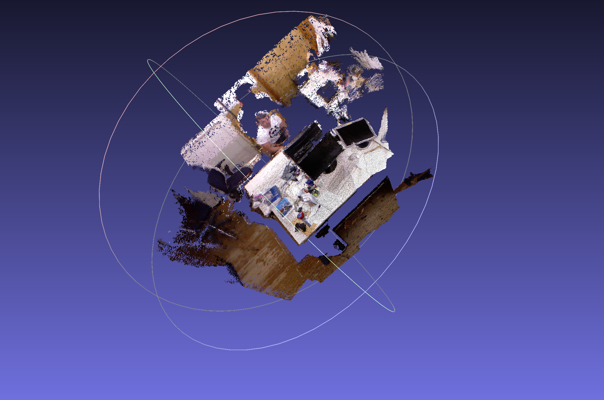
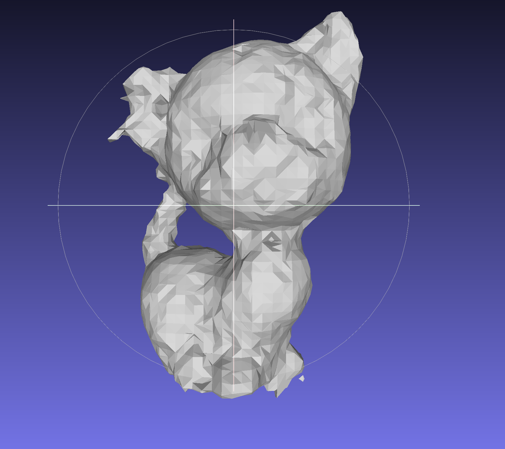
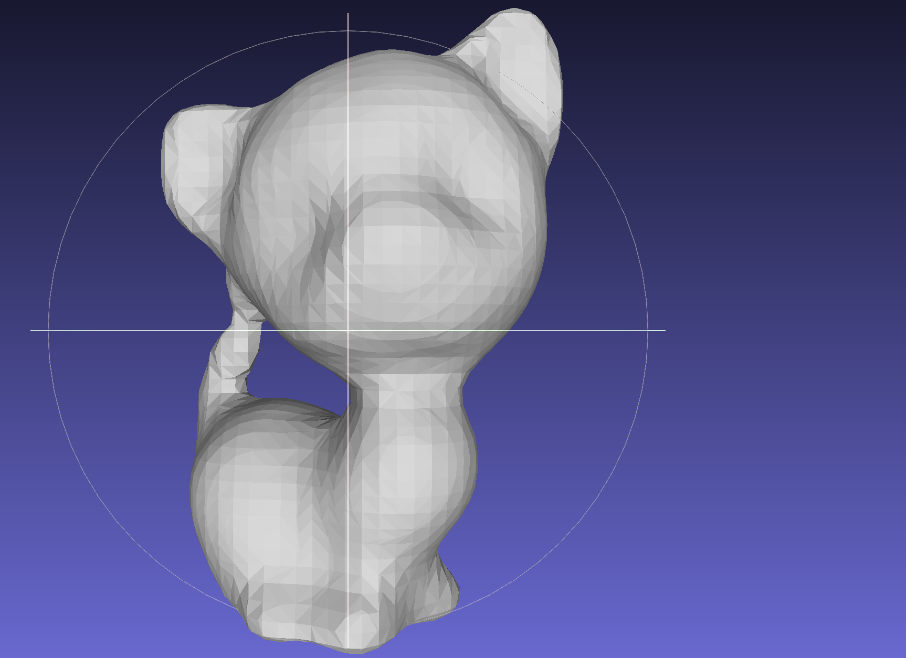
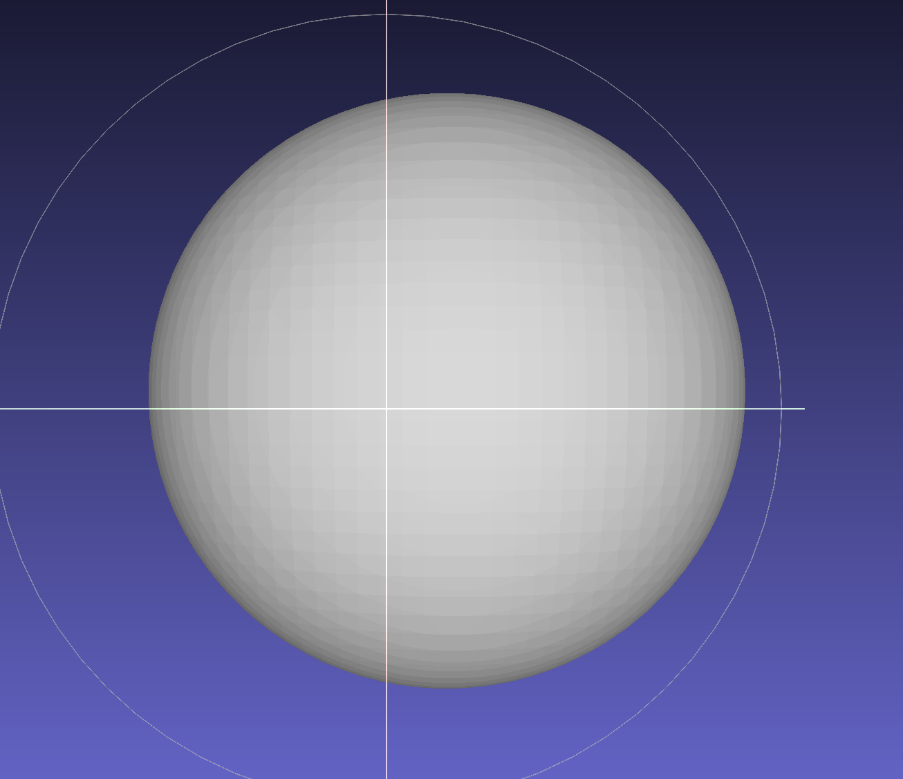
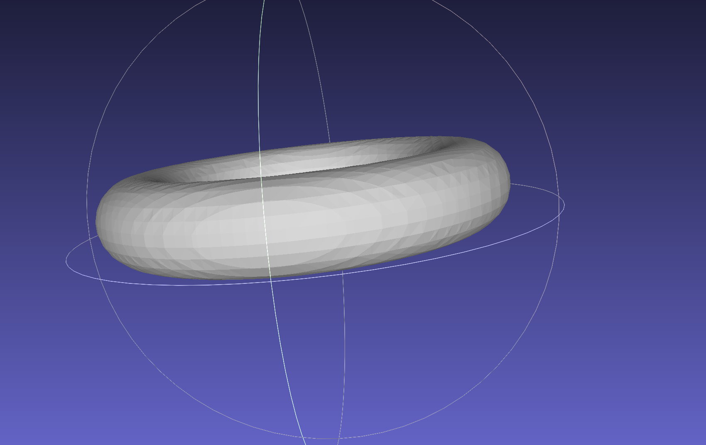
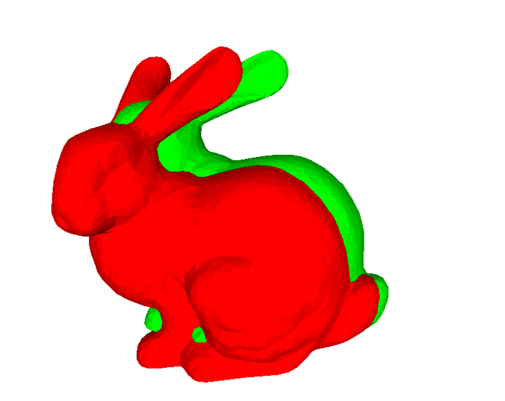
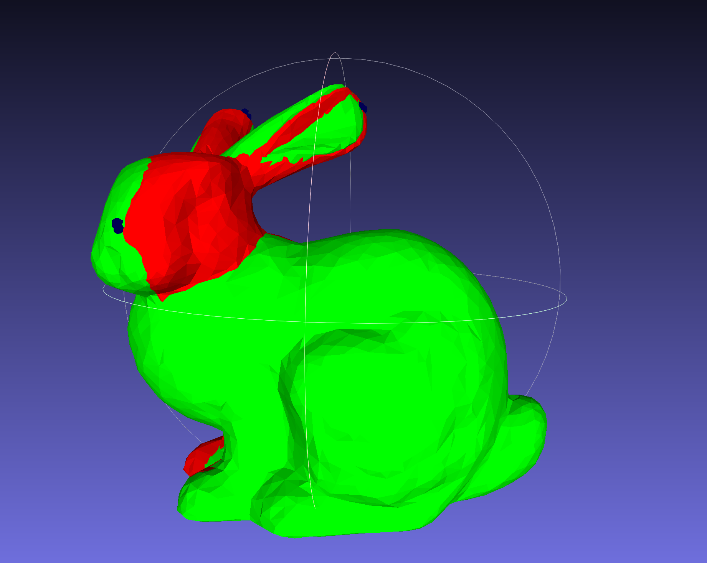
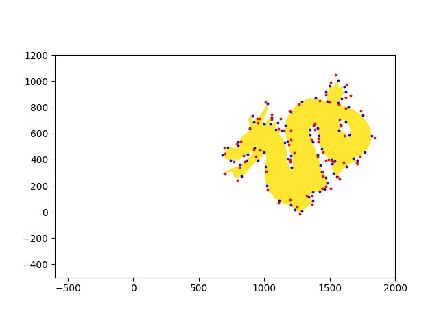
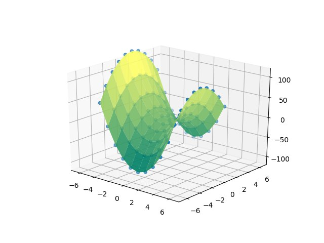

# 3D-Scanning-Motion-Capture
This is a repository for the 3D Course. It contains the code for the scanning and motion capture projects. The screenshots are taken from MeshLab. You need to install MeshLab to view the results.
## 1-Back-Projection
Use the intrinsics of the depth camera to back-project the pixels of the depth map to the camera space of the depth camera.
Transform the back-projected 3D points to world space
- use the inverse of the extrinsic transformation matrix of the depth camera to transform the points to the sensor camera space (note that this task is optional since the extrinsics of the color and the depth camera are the identity in this dataset).
- use the provided trajectory to transform the points to world space. Assign the color information to the 3D world space vertices.
- Dataset: [TUM RGB-D Slam Dataset and Benchmark](https://cvg.cit.tum.de/data/datasets/rgbd-dataset)

## 2-Implicit Surfaces
Generate 3D meshes from implicit surfaces. 
- From hoppe to RBF

## 3-Coarse Alignment: Procrustes Algorithm
Align two point clouds using the Procrustes algorithm.

## 4-Optimization problems with Ceres

